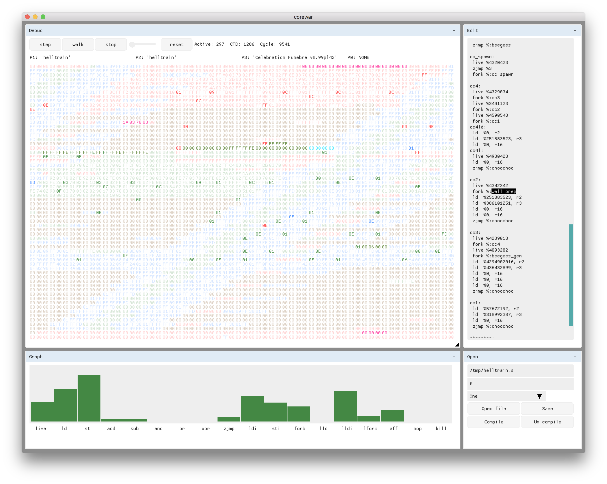

# Corewar



Corewar is a game that consists of making small assembly programs fight in a virtual machine. Each program has a small (and confusing!) instruction set. Every number of cycles each thread must call live or it will be culled. The last player to call live wins.

## Resources
- Subject pdfs in resources
- Sample assembler, VM, champions in resources/vm_champs
- [42 Corewar cookbook](https://github.com/VBrazhnik/Corewar/wiki)

## Building
Build glfw and glew by running `make deps`.
Then run `make` to compile and link both corewar and the assembler.

## Assembler
### Usage
```sh
./asm file.s        # assembles asm file and writes to file.cor
./asm -d file.cor   # disassembles binary and writes to file.s
```

## Virtual Machine
### Usage
```sh
./corewar -abcd:hlnpv: [files.cor, ...]
  -a    enable the `aff' instruction
  -b	run GUI in background
  -c    enable color
  -d[n] dump the vm's core memory after `n' cycles
  -h    show help
  -l    pause at the end of execution to allow for leak checking
  -n    disable gui mode
  -p    dump the processes
  -v[n] enable verbose output
```

### Debug
- **Step**: Steps forward one cycle.
- **Walk**: Steps until a process executes an instruction.
- **Run**: Runs the program until there is a winner.
- **Slider**: Change execution speed.
- **Reset**: Reset the state of the vm and unload every program.

### Open
- **Open File**: Opens .cor files at the specified location and opens any other file in the Edit window.
- **Save**: Writes the contents of the Edit buffer to the specified file.
- **Compile**: Compiles the contents of the Edit buffer and writes the result to the specified file.
- **Decompile**: Decompiles the specified .cor file and loads the result into the Edit buffer.

### Edit
An editable text buffer used for writing corewar assembly files

### Graph
Shows instruction execution frequency.
